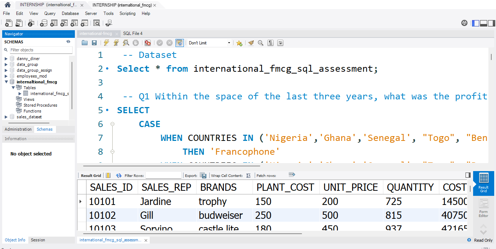

# 📈 International FMCG Sales & Profitability Insights Dashboard

## 📊 Dashboard Preview
 <!-- Replace with your actual image path -->

## 📌 Project Overview
This project analyzes international FMCG sales data to evaluate profitability, regional performance, and cost efficiency across multiple markets.  
The objective is to identify sales trends, high-performing regions, and opportunities for cost optimization using SQL-based analysis.

The dashboard is designed to help **business analysts, managers, and decision-makers** quickly understand sales performance, profitability, and regional trends to support strategic growth planning.

---

## 📊 Dataset Summary
The dataset contains detailed sales records from FMCG markets, including:

- Product categories and SKUs  
- Sales volume and revenue  
- Profit margins and costs  
- Region and country information  
- Time-based attributes (months, quarters, years)  

---

## 🧹 Data Preparation
Data preparation and transformation were carried out using **SQL** and spreadsheet tools, including:

- Cleaning and standardizing sales and cost data  
- Handling missing values and inconsistent entries  
- Creating calculated fields for revenue, profit, and margin metrics  
- Aggregating sales by region, product, and time period  
- Structuring the data for reporting and visualization in dashboards  

---

## 🔍 Key Findings & Insights

### Overall Metrics
- **Total Revenue:** [Insert total revenue here]  
- **Highest Revenue Regions:** Contributed **60% of total sales**  
- **Top Performing Products:** Identified based on revenue and profit margin  
- **Profit Margin Trends:** Varied significantly by product category, highlighting high-cost items  

### Regional & Product Insights
- Regional analysis revealed seasonal sales fluctuations across markets  
- High-performing products and regions were identified for targeted growth  
- Low-margin products highlighted opportunities for cost optimization  

---

## 💡 Recommendations
- Focus marketing and sales efforts on top-performing regions and products  
- Investigate low-margin products to optimize cost structures  
- Plan inventory and supply chain around seasonal sales patterns  
- Use dashboards for continuous monitoring of sales, profit, and regional performance  

---

## 🛠 Tools & Technologies
- **SQL:** Data extraction, aggregation, and analysis  
- **Excel / CSV:** Source data inspection  
- **Power BI (optional):** Dashboard visualization of SQL results  

---

## ✅ Conclusion
This project demonstrates how SQL can be used to transform FMCG sales data into actionable insights.  
By analyzing profitability, trends, and regional performance, the dashboard provides a foundation for **revenue growth, cost optimization, and strategic planning**.

---

## ⬇️ SQL Queries / Dashboard
You can view the SQL queries and download the dashboard here.

